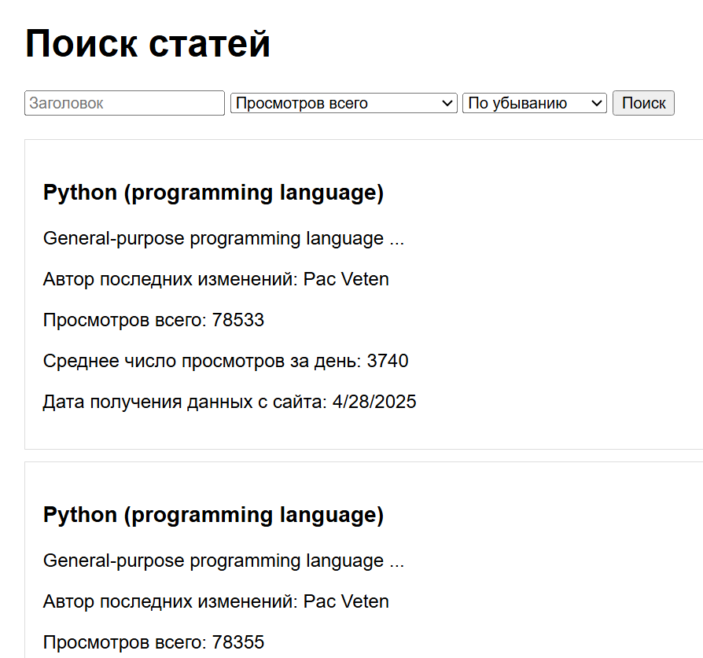

# Web интерфейс через API

API для анализа статей Википедии с web-интерфейсом. Включает сбор статистики просмотров, визуализацию данных и работу с SQLite базой данных.

## Основные возможности
### Работа с данными
- Получение данных о статье Wikipedia (заголовок, дата последней правки, автор, количество символов в статье, ссылки, изменения).
- Статистика по количеству просмотров статьи за последние 20 дней, включая среднесуточные просмотры.

### Функционал API
- Возможность фильтрации по названию статьи.
- Сортировка в порядке возрастания/убывания по id статьи, дате сбора информации о статье, по общему количеству просмотров, а также по среднесуточному количеству просмотров.
- Отображение максимум 5 результатов на странице.

### Визуализация
- Визуализация данных через графики и диаграммы

### Web интерфейс для взаимодействия с API

## Запуск интерфейса
Для запуска web-интерфейса потребуется сначала установить все зависимости из requirements.txt 

Сделать это можно при помощи команды:
**pip install -r requirements.txt**

Cледом требуется запустить файл **main**, который запустит сервер локально и позволит получить доступ к API. 

Автоматически генерируемая документация для API доступна после запуска сервера при переходе по ссылке: http://127.0.0.1:8000  

Для доступа к Web-интерфейсу после запуска сервера требуется открыть файл **web** 

Для успешной работы проекта важно, чтобы все файлы из репозитория находились в одной папке, а сервер был запущен.
